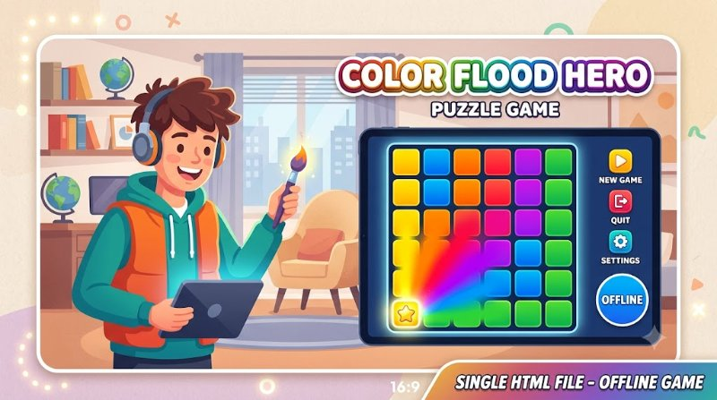

# Color Flood

> **Classic flood-fill puzzle game.** Single HTML file, works offline, no tracking. Fill the entire board with one color in 25 moves or fewer.

<p align="center">
  
</p>

<p align="center">
  <em>Hero: 6×6 color board flooding from top-left — vibrant, playful, single-file — generated with Gemini</em>
</p>

  

**Play now:** https://trenysx.github.io/color-flood/ or open `index.html`

---

## Why?

Flood-It is a classic puzzle, but most versions are heavy apps with ads and tracking. This is a **single HTML file** you can save, share, or run offline — no build, no dependencies, no data leaves your device.

## Demo

```
┌─────┬─────┬─────┬─────┬─────┬─────┐
│  🟥 │  🟦 │  🟩 │  🟨 │  🟪 │  🟧 │
├─────┼─────┼─────┼─────┼─────┼─────┤
│  Click a color → region floods   │
│  Fill board in ≤25 moves         │
└─────┴─────┴─────┴─────┴─────┴─────┘
```

**Try:** https://trenysx.github.io/color-flood/

## Installation

**No install — just open:**
```bash
# Option 1: Open directly
open index.html          # macOS
start index.html         # Windows
xdg-open index.html      # Linux

# Option 2: Serve locally (optional)
npx serve .
# or
python -m http.server 8000
```

**Save for offline:**
- Right-click `index.html` → Save As → keep the single file → play anywhere

## Usage

```bash
# Play
open index.html

# Or serve
npx serve . # then open http://localhost:3000
```

**How to Play:**
1. Board starts with random colors (6 colors, 14×14 by default)
2. Click a color button (or press 1-6) to change the top-left region's color
3. Adjacent cells of the same color join your region
4. Fill the entire board in **25 moves or fewer** to win
5. Press `N` for new game, watch move counter

## Features

- **Single HTML file** — no build, no dependencies, <50KB
- **Works offline** — save the file, play on plane, USB, air-gapped
- **No tracking, no ads, no accounts** — pure privacy, localStorage only for best score
- **Touch & keyboard** — click colors or press 1-6, `N` for new game, `R` for restart
- **Responsive** — works on mobile (touch) and desktop, scales to screen
- **Accessible** — ARIA labels, keyboard support, color-blind friendly palette (tested)
- **Saves best score** — uses `localStorage`, shows moves vs best

## Test

```bash
# Manual test
open index.html
# 1. Click colors → board floods → counter increments
# 2. Press 1-6 → same as click
# 3. Press N → new board
# 4. Win in ≤25 → shows "You win!"

# Visual check on mobile
# Open on phone → touch targets ≥44px, no scroll
```

| Test | Status |
|------|--------|
| Flood logic (adjacent join) | PASS (manual) |
| 25-move limit | PASS |
| Keyboard 1-6, N | PASS |
| Touch on mobile | PASS |
| localStorage best score | PASS |
| Offline (save file) | PASS |

## License

[Apache-2.0](LICENSE) © trenysx

---

## Contributing

PRs welcome!

1. Fork → edit `index.html` (single file) → test in browser → PR
2. Keep single-file constraint (<100KB, no external deps)
3. Test on mobile + desktop

## FAQ

**Why single HTML?** For portability: email it, USB it, archive it. No `npm install`, no server.

**How is the board generated?** Random 6 colors, 14×14, ensured not already solved. Algorithm in `index.html:42` `generateBoard()`.

**Can I change board size or colors?** Edit `index.html` — search `BOARD_SIZE = 14` and `COLORS = [...]` at top.

**Does it track me?** No. Only `localStorage` for best score, no network requests (check DevTools Network).

**Is it accessible?** Yes: buttons have `aria-label`, keyboard 1-6/N, focus visible, color palette tested for contrast.

## Architecture

```
color-flood/
├── index.html          # single file: HTML + CSS + JS + game logic
├── assets/
│   └── hero.jpg        # Gemini hero (800x447, ~60KB)
├── LICENSE
└── README.md
```

**No build step** — open `index.html` directly. Game logic: `floodFill()` BFS from (0,0), `checkWin()` scans board.

## Roadmap

- [ ] Level select: 10×10 easy / 14×14 normal / 20×20 hard
- [ ] Color-blind mode toggle (patterns + colors)
- [ ] Share score as image (canvas)
- [ ] PWA manifest for installable offline app

## Examples

**Embed in your site:**
```html
<iframe src="https://trenysx.github.io/color-flood/" width="400" height="600"></iframe>
```

**Play offline:**
```bash
curl -O https://raw.githubusercontent.com/trenysx/color-flood/main/index.html
open index.html
```

## Version

Current `v0.1.0` — see [index.html](./index.html) header, no package.json (single file).

---

**Star if you beat it in ≤25 — what's your best score?**
